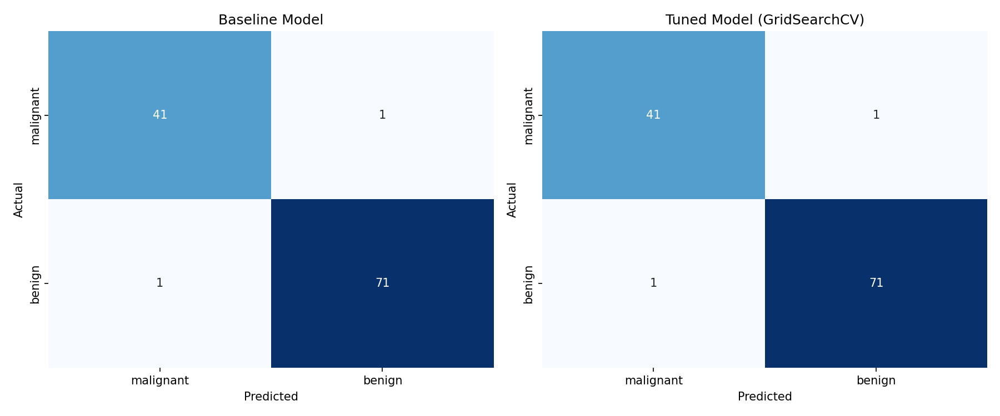

# Day 10 - Model Evaluation & Hyperparameter Tuning

Breast Cancer Prediction System built on the Breast Cancer Wisconsin
(Diagnostic) Dataset from `sklearn.datasets`. This is the point where the
internship moves past "does the model run" and into "is the model actually
good, and how do I make it better."

## Folder Structure

```
Day-10/
├── scripts/
│   ├── 01_data_exploration.py       # load, DataFrame, head/info/describe, class balance
│   ├── 02_baseline_model.py         # train/test split, default Logistic Regression, metrics
│   ├── 03_hyperparameter_tuning.py  # GridSearchCV (F1 + F2), best params, comparison
│   └── 04_final_pipeline.py         # end-to-end pipeline + confusion matrix heatmap
├── outputs/
│   ├── breast_cancer_data.csv
│   ├── baseline_results.json
│   ├── tuning_results.json
│   └── confusion_matrix_comparison.png
├── app.py                            # Streamlit app - upload data, run everything from UI
├── requirements.txt
└── README.md
```

Run order: `01 → 02 → 03 → 04`, or just run `04_final_pipeline.py` on its
own since it doesn't depend on the earlier scripts having run.

---

## What I Learned About Model Evaluation

Training a model and getting a high accuracy number means almost nothing
on its own. A model can memorize the training data and still fail
completely on new data - that's overfitting, and accuracy on the training
set won't ever show it to you. That's why every evaluation in this
project is measured on data the model never saw during training (the test
split), not the data it was trained on.

A few concepts that actually changed how I look at a trained model:

- **Train vs Test Performance** - if training accuracy is much higher than
  test accuracy, the model has overfit: it learned the noise in the
  training data instead of the actual pattern. If both are low, it's
  underfitting: the model is too simple to capture the pattern at all.
- **Cross Validation** - a single train/test split can get lucky or
  unlucky depending on which rows land in the test set. 5-fold CV trains
  and validates the model 5 times on different slices of the training
  data and averages the result, which gives a far more trustworthy
  estimate than one split.
- **Learning Curves** - plotting training vs validation error as the
  training set size grows shows whether more data would even help. A
  large, unclosing gap between the two curves is the visual signature of
  overfitting.
- **Choosing the right metric** - accuracy is misleading on imbalanced
  data. This dataset is a medical diagnosis problem, so recall matters a
  lot: missing an actual malignant case (a false negative) is far more
  costly than a false alarm. That's why this project doesn't stop at a
  single tuned model - it compares **three** models scored on different
  objectives (see below), instead of assuming one metric fits the problem.
- **Positive-label sensitivity** - which class counts as "positive" isn't
  a fixed fact, it's a choice. For the built-in dataset, `0 = malignant`
  and that's treated as the critical/positive class. For a user-uploaded
  CSV, the label encoding could easily be reversed, so the app now asks
  the user which value is the critical class instead of assuming - a
  hardcoded assumption here would silently flip precision/recall for
  anyone using their own data.

## What Hyperparameter Tuning Is and Why It Matters

Hyperparameters are the settings you choose *before* training starts -
things like `C` (regularization strength) or `penalty` for Logistic
Regression - as opposed to the weights the model learns on its own during
training. A model's actual capability is fixed by its algorithm, but its
*performance* is often held back by using the default settings.

**GridSearchCV** takes a fixed grid of hyperparameter combinations, trains
and cross-validates the model on every single one, and returns whichever
combination scored best. It's exhaustive - if the grid has 15 valid
combinations and cv=5, that's 75 model fits per scoring metric.
**RandomizedSearchCV** solves the same problem but samples a fixed number
of random combinations instead of trying all of them - much faster on
large search spaces, at the cost of not guaranteeing the absolute best
combination gets tested.

For this project, GridSearchCV was used since the Logistic Regression
search space is small enough to search exhaustively without it being slow.
It's run **twice** with two different scoring objectives, producing two
tuned models on top of the baseline:

- **F1-tuned** - optimizes the harmonic mean of precision and recall
  equally.
- **F2-tuned** (β = 2) - weights recall roughly twice as heavily as
  precision. In a malignant/benign screening context, a false negative
  (missed cancer) is far more costly than a false positive (extra
  follow-up test), so F2 is the more clinically defensible objective for
  this problem.

## Best Parameters Found by GridSearchCV

```
F1-tuned: {'C': 1, 'penalty': 'l2', 'solver': 'lbfgs'}
F2-tuned: {'C': 1, 'penalty': 'l2', 'solver': 'lbfgs'}
```

Best cross-validated F1-score (F1 search): **0.9731**
Best cross-validated F2-score (F2 search): **0.9679**

> Note: all three models (baseline, F1-tuned, F2-tuned) converged to the
> **exact same hyperparameters** within the fixed grid. That's a sign of
> **stability** in this search space, not proof of a global optimum - it
> just means, for this dataset, the grid didn't contain a combination
> that meaningfully separates the objectives. As a result, all three
> models also score identically on the held-out test set below.

## Baseline vs Tuned Models - Comparison

All metrics use **malignant as the positive class** (not sklearn's
default of benign) - correctly catching malignant cases is what matters
for this problem.

| Metric    | Baseline | F1-Tuned | F2-Tuned |
|-----------|----------|----------|----------|
| Accuracy  | 0.9825   | 0.9825   | 0.9825   |
| Precision | 0.9762   | 0.9762   | 0.9762   |
| Recall    | 0.9762   | 0.9762   | 0.9762   |
| F1-Score  | 0.9762   | 0.9762   | 0.9762   |

(Numbers come from `outputs/tuning_results.json` and `outputs/baseline_results.json`,
generated by running the scripts in this folder - not hardcoded.)



## Key Observations

- All three models - baseline, F1-tuned, and F2-tuned - landed on the
  **exact same hyperparameters** (`C=1, penalty=l2, solver=lbfgs`), so
  they also score **identically** on the held-out test set (accuracy,
  precision, recall, F1 all equal across the board). This isn't a bug -
  the search grid is small and Logistic Regression's default `C=1` was
  already a strong choice for this dataset, so there was no combination
  in the grid that could beat it on either objective.
- The fact that the F1-search and F2-search both converged to `C=1`
  despite optimizing different objectives (F1 vs F2, i.e. equal weight vs
  recall-weighted) is itself informative: it suggests the model isn't
  very sensitive to the precision/recall trade-off on this particular
  grid, rather than showing that F2-tuning had no effect.
- Precision and recall being equal (0.9762) for every model is a property
  of this specific test split's confusion matrix (equal false positives
  and false negatives), not a general guarantee.
- This dataset is small (569 rows) and fairly easy to separate (all
  models score above 97% on every metric), so the ceiling for improvement
  from tuning is naturally small - there isn't much headroom left to
  gain. On a messier, larger, or more imbalanced dataset, the gap between
  baseline and tuned performance - and between F1-tuned and F2-tuned -
  would likely be much more visible.
- Best CV scores during the search (F1: 0.9731, F2: 0.9679) are lower
  than the test-set scores (0.9762+) shown above. That's expected -
  cross-validated scores average performance over 5 folds including
  harder splits, while the single held-out test set happened to be a
  relatively easy split. The CV score is still the more trustworthy
  estimate of real-world performance, even though the test-set number
  looks better here.
- Takeaway: tuning "not changing anything" on a small, easily-separable
  dataset like this is a legitimate result, not a failure - it shows the
  default hyperparameters were already close to optimal, which is useful
  information on its own.

## Streamlit App

The `app.py` file provides a UI version of this entire pipeline:

1. **Dataset Exploration** - preview, describe, class distribution,
   imbalance ratio. Works with the built-in sklearn dataset or an
   uploaded CSV (must include a `target` column with binary labels). For
   uploaded data, a sidebar selector asks which target value is the
   critical/positive class instead of assuming - the built-in dataset
   still defaults to `0 = malignant`.
2. **Baseline + GridSearchCV Tuning** - one click trains all three models
   (baseline, F1-tuned, F2-tuned) and shows a side-by-side metrics +
   confusion matrix comparison, with a CSV download for the comparison
   table.

### Session-state fixes applied
- If training throws an exception, `st.session_state["trained"]` is now
  reset to `False` so the UI doesn't keep showing stale results from a
  previous successful run.
- Switching datasets (built-in ↔ uploaded CSV) now clears old `input_*`
  slider keys from session state, preventing a `StreamlitAPIException`
  when a same-named feature has a different min/max range in the new
  dataset.

Run locally:
```bash
pip install -r requirements.txt
streamlit run app.py
```

**Public link:** *(add your deployed Streamlit Community Cloud link here
after deployment - see note below)*