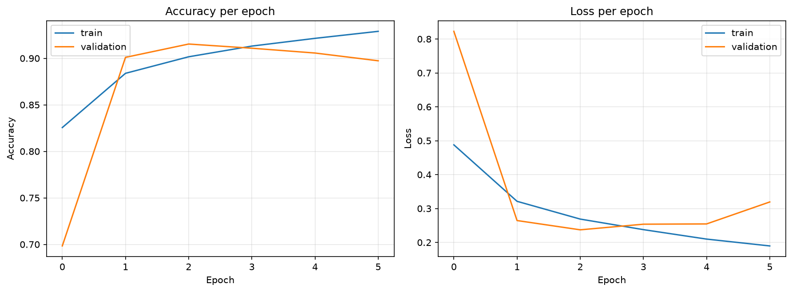
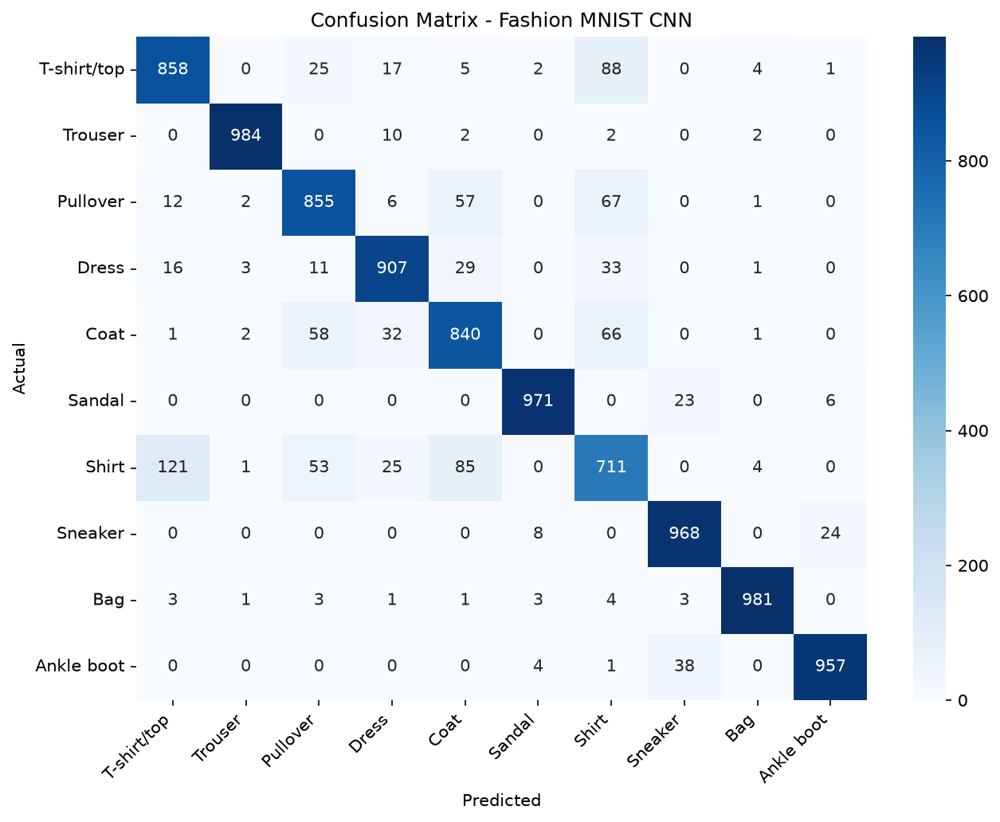

# Day 13 - Convolutional Neural Networks (CNN)

MLB Summer Internship | Day 13
Topic: CNNs + Image Classification on Fashion MNIST

## Folder structure

```
Day-13/
├── cnn_practice.py               # Practice 1, 2, 3 (load data, build/train a small CNN, evaluate)
├── fashion_mnist_classifier.py   # Mini project - full CNN pipeline + evaluation
├── requirements.txt
├── data/                         # Fashion MNIST idx-ubyte files (gitignored, see below)
├── outputs/
│   ├── practice/
│   │   ├── sample_images.png
│   │   └── sample_predictions.png
│   └── project/
│       ├── 01_sample_images.png
│       ├── 02_training_curves.png
│       ├── 03_sample_predictions.png
│       ├── 04_confusion_matrix.png
│       ├── 05_correctly_classified.png
│       ├── 06_incorrectly_classified.png
│       └── classification_report.txt
└── README.md
```

## Setup

```bash
python -m venv venv
venv\Scripts\activate        # Windows (PowerShell)
pip install -r requirements.txt
```

**About the dataset:** `keras.datasets.fashion_mnist.load_data()` normally pulls the
data from Google Cloud Storage, but that URL was blocked on the machine I was
working on, so both scripts read the raw idx-ubyte `.gz` files from `data/`
instead (I parse the format manually — it's the same dataset, just avoiding
the GCS download). If you're cloning this repo fresh, grab the 4 files from
the [official Fashion-MNIST repo](https://github.com/zalandoresearch/fashion-mnist/tree/master/data/fashion)
and drop them into `Day-13/data/` before running anything.

## Running

```bash
python cnn_practice.py               # Practice 1-3
python fashion_mnist_classifier.py   # Mini project
```

---

## Why CNNs are better than ANNs for image data

A plain ANN (fully connected network) flattens an image into a 1D vector before
it sees any of it, so it throws away all the spatial structure — a pixel that's
5 rows down means nothing special to it, it's just "input #145". That also means
the number of parameters explodes fast (every pixel connects to every neuron in
the next layer), and the network has to re-learn what an edge or curve looks
like separately for every single position in the image.

CNNs fix both problems:
- **Local connectivity** - a convolution filter only looks at a small patch at a
  time, so it can learn local patterns (edges, corners, textures) instead of
  needing a connection to every pixel.
- **Parameter sharing** - the same filter slides across the whole image, so a
  filter that learns to detect a vertical edge in the top-left corner will also
  detect it anywhere else in the image, without needing separate weights.
- **Translation invariance** - because of the above, CNNs can recognize an
  object (like a shoe) even if it's shifted a few pixels compared to training
  images.

That's why a CNN with ~240K parameters here gets over 91% test accuracy, while
a comparable-sized plain ANN typically plateaus a few points lower on the same
data.

## Purpose of convolution and pooling layers

- **Convolution layer** - slides a small filter (kernel, e.g. 3x3) over the
  image and computes a dot product at each position, producing a *feature
  map*. Early conv layers tend to pick up low-level features (edges,
  gradients), and deeper conv layers combine those into higher-level shapes
  (collars, straps, soles, etc.).
- **Pooling layer (Max Pooling here)** - downsamples the feature map, keeping
  only the strongest activation in each region. This does two things: reduces
  the spatial size (so the network gets faster and needs fewer params in the
  dense layers), and adds a bit of translation invariance since small shifts
  in the input don't change the max value much.

## Model architecture

`cnn_practice.py` (Practice 2) uses a small baseline CNN:

```
Conv2D(32, 3x3, relu) -> MaxPool(2x2)
Conv2D(64, 3x3, relu) -> MaxPool(2x2)
Flatten -> Dense(128, relu) -> Dropout(0.3) -> Dense(10, softmax)
```

`fashion_mnist_classifier.py` (mini project) uses a slightly deeper version,
since I noticed the baseline's validation loss was still improving at epoch 6:

```
Conv2D(32, 3x3, same, relu) -> BatchNorm -> MaxPool(2x2)
Conv2D(64, 3x3, same, relu) -> BatchNorm -> MaxPool(2x2)
Conv2D(128, 3x3, same, relu) -> BatchNorm -> MaxPool(2x2)
Flatten -> Dense(128, relu) -> Dropout(0.4) -> Dense(10, softmax)
```

- Optimizer: Adam
- Loss: sparse categorical crossentropy
- Batch size: 128
- Up to 12 epochs, with `EarlyStopping(monitor="val_loss", patience=3, restore_best_weights=True)`
  — training actually stopped at epoch 9 since val_loss stopped improving after epoch 5.
- Total params: ~242K

## Results

| Metric | Value |
|---|---|
| Final training accuracy | 94.08% |
| Test accuracy | 91.14% |
| Test loss | 0.2558 |

Training curves:



Confusion matrix:



Full precision/recall/F1 breakdown is in `outputs/project/classification_report.txt`.
The class-wise numbers line up with what the confusion matrix shows —
**Shirt** is the weakest class (73% F1), and it's almost entirely confused
with **T-shirt/top**, **Pullover**, and **Coat**. That makes sense, those four
classes genuinely look alike at 28x28 grayscale resolution, even to me
scrolling through the incorrect-predictions grid.

## Challenges faced and how I solved them

1. **`fashion_mnist.load_data()` failing with a 403 error.** Keras tries to
   download the dataset from `storage.googleapis.com`, which wasn't reachable
   from my environment. Fixed by downloading the raw idx-ubyte `.gz` files
   from the official Fashion-MNIST GitHub repo instead and writing a small
   parser (`_read_idx_images` / `_read_idx_labels`) that reads the same
   binary format Keras would have given me — same data either way.
2. **Baseline CNN's val_loss plateauing early.** The Practice 2 model (2 conv
   blocks) hit ~90% test accuracy but validation loss had basically flattened
   by epoch 6. For the mini project I added a 3rd conv block + batch
   normalization, which let the model learn more before overfitting kicked
   in, and used `EarlyStopping` with `restore_best_weights=True` so it
   doesn't just keep training past the point where val_loss starts creeping
   back up.
3. **Confusing classes (Shirt/T-shirt/Pullover/Coat).** No amount of
   architecture tweaking removed this entirely — checked the confusion matrix
   and it's a genuine ambiguity in the data at this resolution, not a bug.
   Documented it above instead of chasing a marginal accuracy gain by
   overfitting to it.


